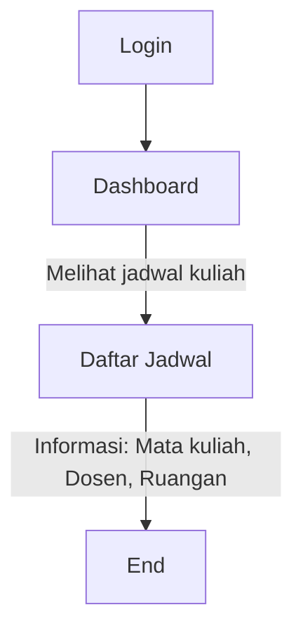
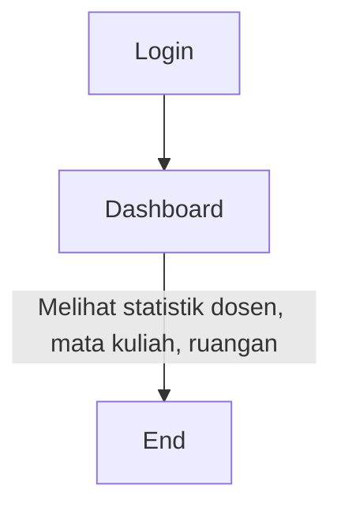

# Sistem Penjadwalan Otomatis - RUUQI

Sistem informasi penjadwalan mata kuliah otomatis berbasis web dengan fitur charter dan barter jadwal untuk perguruan tinggi.

## 🚀 Fitur Utama

### 1. **Dekan**
- ✅ CRUD Data Master (Dosen, Ruangan, Mata Kuliah, Kelas)
- ✅ Membuat & Approve Surat Tugas Mengajar
- ✅ Dashboard lengkap dengan statistik

### 2. **Kaprodi**
- ✅ CRUD Data Master (sama seperti Dekan)
- ✅ Mengelola mata kuliah dan kelas per prodi
- ✅ Dapat ditandai sebagai Dekan

### 3. **Dosen**
- ✅ Login ke aplikasi
- ✅ Charter jadwal pada slot yang tersedia
- ✅ Barter jadwal dengan dosen lain
- ✅ Melihat jadwal mengajar

### 4. **KOSMA (Ketua Organisasi Mahasiswa)**
- ✅ Menerima permintaan pindah jadwal
- ✅ Approve/Reject permintaan pindah jadwal

### 5. **Mahasiswa**
- ✅ Melihat jadwal kuliah per kelas

### 6. **Sekretaris Prodi**
- ✅ Melihat data statistik

## 📋 Persyaratan Sistem

- PHP >= 8.1
- Composer
- MySQL/MariaDB
- Node.js & NPM (untuk asset compilation)
- Laravel 11.x

## 🛠️ Instalasi

### 1. Clone Repository
```bash
git clone <repository-url>
cd penjadwalan
```

### 2. Install Dependencies
```bash
composer install
npm install
```

### 3. Konfigurasi Environment
```bash
cp .env.example .env
php artisan key:generate
```

Edit file `.env`:
```env
DB_CONNECTION=mysql
DB_HOST=127.0.0.1
DB_PORT=3306
DB_DATABASE=penjadwalan
DB_USERNAME=root
DB_PASSWORD=
```

### 4. Migrasi Database & Seeder
```bash
php artisan migrate:fresh --seed
```

### 5. Jalankan Aplikasi
```bash
php artisan serve
```

Aplikasi akan berjalan di `http://localhost:8000`

## 👤 Akun Demo

| Role | Username | Password |
|------|----------|----------|
| Dekan | dekan123 | dekan123 |
| Kaprodi | kaprodi123 | kaprodi123 |
| Dosen | dosen123 | dosen123 |
| KOSMA | kosma123 | kosma123 |
| Mahasiswa | mahasiswa123 | mahasiswa123 |
| Sekprodi | sekprodi123 | sekprodi123 |

## 📖 Panduan Penggunaan per Role

### 🎓 1. DEKAN

#### Login
1. Buka browser dan akses `http://localhost:8000`
2. Login dengan:
   - **Username**: `dekan123`
   - **Password**: `dekan123`
3. Anda akan diarahkan ke Dashboard Dekan

#### Fitur yang Dapat Diakses:
- **Dashboard**: Melihat statistik lengkap (dosen, mahasiswa, mata kuliah, dll)
- **Kelola Mata Kuliah**: `/mata-kuliah`
  - Tambah, Edit, Hapus mata kuliah
  - Filter berdasarkan prodi
- **Kelola Kelas**: `/kelas`
  - Tambah, Edit, Hapus kelas
  - Filter berdasarkan angkatan dan prodi
- **Kelola Dosen**: `/dosen`
  - Lihat daftar dosen
  - Export PDF daftar dosen
  - Toggle status Dekan untuk Kaprodi
- **Surat Tugas Mengajar**: `/surat-tugas`
  - Buat surat tugas baru
  - Approve/Reject surat tugas
  - Download PDF surat tugas

#### Cara Approve Surat Tugas:
1. Buka menu "Surat Tugas Mengajar"
2. Klik tombol "Setuju" pada surat tugas dengan status "Pending"
3. Untuk menolak, klik "Tolak" dan isi alasan penolakan

---

### 👨‍🏫 2. KAPRODI

#### Login
1. Akses `http://localhost:8000`
2. Login dengan:
   - **Username**: `kaprodi123`
   - **Password**: `kaprodi123`

#### Fitur yang Dapat Diakses:
Sama seperti Dekan, ditambah:
- Dapat ditandai sebagai Dekan oleh user Dekan
- Mengelola data master di bawah program studinya

#### Cara Mengelola Mata Kuliah:
1. Klik menu "Mata Kuliah"
2. Klik "Tambah Mata Kuliah"
3. Isi form:
   - Kode Mata Kuliah (contoh: MK001)
   - Nama Mata Kuliah
   - SKS (1-6)
   - Pilih Program Studi
   - Pilih Status (Aktif/Nonaktif)
4. Klik "Simpan"

#### Cara Mengelola Kelas:
1. Klik menu "Kelas"
2. Klik "Tambah Kelas"
3. Isi form dengan format: `PRODI-SHIFT-SEMESTER-ANGKATAN`
   - Contoh: `SI-R-SM3-20251`
4. Pilih angkatan, prodi, semester, shift, dan status
5. Klik "Simpan"

---

### 👨‍💼 3. DOSEN

#### Login
1. Akses `http://localhost:8000`
2. Login dengan:
   - **Username**: `dosen123`
   - **Password**: `dosen123`

#### Dashboard
Setelah login, Anda akan melihat:
- Total surat tugas mengajar
- Total jadwal mengajar
- Permintaan barter masuk/keluar
- Jadwal minggu ini

#### 📅 Charter Jadwal

**Langkah-langkah:**
1. Klik menu **"Charter Jadwal"** di sidebar
2. Lihat 2 tabel:
   - **Jadwal Yang Sudah Di-charter**: Jadwal yang sudah Anda ambil
   - **Slot Jadwal Tersedia**: Slot kosong yang bisa di-charter

3. **Untuk Charter Slot Baru:**
   - Klik tombol **"Charter"** pada slot yang diinginkan
   - Modal akan muncul menampilkan detail jadwal
   - Pilih **Mata Kuliah** dari dropdown
   - Pilih **Kelas** dari dropdown
   - Klik **"Charter"**
   
4. **Hasil:**
   - Sistem otomatis membuat Surat Tugas Mengajar
   - Jadwal dipindahkan ke tabel "Jadwal Yang Sudah Di-charter"
   - Slot tersebut tidak lagi tersedia untuk dosen lain

5. **Untuk Membatalkan Charter:**
   - Lihat tabel "Jadwal Yang Sudah Di-charter"
   - Klik tombol **"Batalkan"** pada jadwal yang ingin dibatalkan
   - Konfirmasi pembatalan
   - Slot akan kembali tersedia

#### 🔄 Barter Jadwal

**Langkah-langkah:**
1. Klik menu **"Barter Jadwal"** di sidebar
2. Klik tombol **"Ajukan Barter"**

3. **Isi Form Barter:**
   - **Pilih Jadwal Anda**: Pilih jadwal yang ingin Anda tukar
   - **Pilih Dosen**: Pilih dosen yang ingin diajak barter
   - **Pilih Jadwal Yang Diminta**: Sistem akan memuat jadwal dosen tersebut
   - **Alasan Barter**: Jelaskan alasan Anda mengajukan barter
   - Klik **"Ajukan Barter"**

4. **Menunggu Persetujuan:**
   - Status "Pending" = menunggu persetujuan dosen tujuan
   - Anda akan mendapat notifikasi jika disetujui/ditolak

5. **Menerima/Menolak Permintaan Barter:**
   - Jika ada dosen lain mengajukan barter ke Anda
   - Lihat permintaan di halaman "Barter Jadwal"
   - Klik **"Setuju"** untuk menyetujui
   - Klik **"Tolak"** untuk menolak
   - Jika disetujui, jadwal otomatis tertukar

#### 📊 Lihat Jadwal Mengajar
1. Klik menu **"Jadwal Mengajar"**
2. Lihat semua jadwal mengajar Anda
3. Informasi yang ditampilkan:
   - Mata kuliah
   - Kelas
   - Hari
   - Jam
   - Ruangan

---

### 👥 4. KOSMA (Ketua Organisasi Mahasiswa)

#### Login
1. Akses `http://localhost:8000`
2. Login dengan:
   - **Username**: `kosma123`
   - **Password**: `kosma123`

#### Dashboard
Melihat statistik:
- Permintaan pending
- Permintaan disetujui
- Permintaan ditolak

#### 🔀 Approve/Reject Permintaan Pindah Jadwal

**Langkah-langkah:**
1. Klik menu **"Permintaan Pindah Jadwal"**
2. Lihat daftar permintaan dari dosen

3. **Detail Permintaan:**
   - Nama dosen yang mengajukan
   - Jadwal lama
   - Jadwal baru yang diinginkan
   - Alasan pindah jadwal

4. **Untuk Menyetujui:**
   - Klik tombol **"Setuju"**
   - Konfirmasi persetujuan
   - Jadwal otomatis dipindahkan

5. **Untuk Menolak:**
   - Klik tombol **"Tolak"**
   - Isi **alasan penolakan**
   - Klik **"Tolak Permintaan"**

6. **Filter Permintaan:**
   - Gunakan dropdown filter untuk melihat berdasarkan status:
     - Semua Status
     - Pending
     - Disetujui
     - Ditolak

---

### 🎒 5. MAHASISWA

#### Login
1. Akses `http://localhost:8000`
2. Login dengan:
   - **Username**: `mahasiswa123`
   - **Password**: `mahasiswa123`

#### Fitur
- **Dashboard**: Melihat jadwal kuliah kelas Anda
- Informasi yang ditampilkan:
  - Mata kuliah
  - Nama dosen
  - Ruangan
  - Hari dan jam
- Jadwal diurutkan berdasarkan hari dan jam

#### Cara Melihat Jadwal:
1. Setelah login, Anda langsung melihat jadwal di dashboard
2. Jadwal yang tampil adalah jadwal kelas Anda
3. Tidak ada fitur tambahan - hanya read-only

---

### 📋 6. SEKRETARIS PRODI

#### Login
1. Akses `http://localhost:8000`
2. Login dengan:
   - **Username**: `sekprodi123`
   - **Password**: `sekprodi123`

#### Dashboard
Melihat statistik:
- Total dosen
- Total mata kuliah
- Total ruangan

#### Fitur
- Hanya dapat melihat data statistik
- Tidak ada menu CRUD
- Dashboard view-only

---

## 🔧 Troubleshooting

### Error "jadwal_id is null" saat charter
**Solusi**: Pastikan JavaScript di view sudah benar dan tombol charter memiliki data attributes yang lengkap.

### Jadwal yang di-charter tidak muncul
**Solusi**: Cek apakah:
1. STM berhasil dibuat (cek tabel `surat_tugas_mengajar`)
2. Jadwal ter-update dengan `surat_tugas_mengajar_id` (cek tabel `jadwal`)
3. Log di `storage/logs/laravel.log`

### Permission Denied
**Solusi**: Pastikan user memiliki role yang sesuai untuk mengakses menu tersebut.

### Route [dashboard.dosen] not defined
**Solusi**: Jalankan command:
```bash
php artisan route:clear
php artisan cache:clear
php artisan config:clear
```

## 📝 Logging

Log aplikasi tersimpan di `storage/logs/laravel.log`

Untuk debug charter jadwal, log akan menampilkan:
- Data user yang login
- Slot yang dipilih
- STM yang dibuat
- Status update jadwal

## 🗄️ Struktur Database

### Tabel Utama:
- `user` - Data pengguna
- `role` - Peran pengguna
- `biodata` - Biodata pengguna
- `mata_kuliah` - Data mata kuliah
- `kelas` - Data kelas
- `ruangan` - Data ruangan
- `jadwal` - Jadwal perkuliahan
- `surat_tugas_mengajar` - STM dosen
- `barter_jadwal` - Permintaan barter
- `pindah_jadwal` - Permintaan pindah jadwal

Lihat dokumentasi lengkap di `docs/DATABASE_SCHEMA.md`

## 🔐 Middleware & Authorization

### Middleware tersedia:
- `auth` - Memastikan user sudah login
- `role:role1,role2` - Membatasi akses berdasarkan role

Contoh penggunaan:
```php
Route::middleware(['auth', 'role:dekan,kaprodi'])->group(function() {
    Route::resource('mata-kuliah', MataKuliahController::class);
});
```

## 🎯 Flow Sistem

### 1. Flow Charter Jadwal (Dosen)
```mermaid
graph TD;
    A[Login] --> B[Dashboard];
    B -->|Pilih menu "Charter Jadwal"| C[Halaman Charter Jadwal];
    C -->|Pilih slot jadwal yang tersedia| D[Pilih Mata Kuliah & Kelas];
    D --> E[Submit Charter];
    E -->|Jadwal masuk ke "Jadwal Yang Sudah Di-charter"| F[Notifikasi Berhasil];
    F --> B;

    click A href "/login"
    click B href "/dashboard"
    click C href "/charter-jadwal"
    click D href "/charter-jadwal/pilih"
    click E href "/charter-jadwal/submit"
    click F href "/dashboard"
```

### 2. Flow Barter Jadwal (Dosen)
```mermaid
graph TD;
    A[Login] --> B[Dashboard];
    B -->|Pilih menu "Barter Jadwal"| C[Halaman Barter Jadwal];
    C -->|Pilih jadwal yang ingin di-barter| D[Pilih Dosen Tujuan];
    D -->|Pilih jadwal dosen tujuan| E[Isi Alasan Barter];
    E --> F[Submit Pengajuan];
    F -->|Menunggu Approve Dosen Tujuan| G[Notifikasi Barter];
    G --> B;

    click A href "/login"
    click B href "/dashboard"
    click C href "/barter-jadwal"
    click D href "/barter-jadwal/pilih-dosen"
    click E href "/barter-jadwal/alasan"
    click F href "/barter-jadwal/submit"
    click G href "/dashboard"
```

### 3. Flow Approve Pindah Jadwal (KOSMA)
```mermaid
graph TD;
    A[Login] --> B[Dashboard];
    B -->|Pilih menu "Permintaan Pindah Jadwal"| C[Daftar Permintaan];
    C -->|Klik pada permintaan| D[Detail Permintaan];
    D -->|Approve atau Reject| E[Isi Alasan (jika perlu)];
    E --> F[Submit Keputusan];
    F -->|Notifikasi ke Dosen| G[Notifikasi Berhasil];
    G --> B;

    click A href "/login"
    click B href "/dashboard"
    click C href "/pindah-jadwal"
    click D href "/pindah-jadwal/detail"
    click E href "/pindah-jadwal/alasan"
    click F href "/pindah-jadwal/submit"
    click G href "/dashboard"
```

### 4. Flow Melihat Jadwal (Mahasiswa)


### 5. Flow Melihat Statistik (Sekretaris Prodi)
